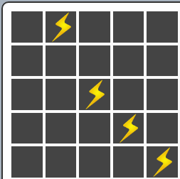
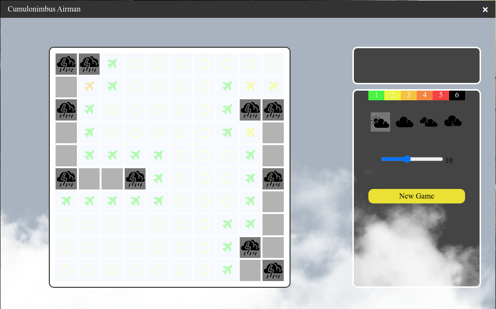

# Cumulonimbus Airman

## General Info
The game was made using Electron(HTML, CSS, JS).

I was inspired by [Ania Kubów project](https://github.com/kubowania/minesweeper).  

The cloud moving animation: [Youtube](https://www.youtube.com/watch?v=FWW38GuIo7M)  

## Game Overview
The game is variation of popular **Minesweeper** (**Saper**) game for aviation's fans.  
You are the pilot and you need to avoid storm clouds.  
Your plane has radar at disposal that displays plane of appropriate color depending on number of thunders arround.  
  

With `right click` you mark cell with storm.  
  

You can also choose difficulty level that is indicated by number of thunders:  
  
and size of flight area:  
  

  
